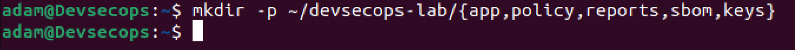

# LAPORAN PRAKTIKUM

## TUGAS 1 — Fondasi Teoretis dan Kerangka Kerja DevSecOps

**Dosen Pengampu:**
Ferry Astika Saputra

**Disusun Oleh:**
Adam Rasyid Nurmuhammad
3126640025
D4-IT-B

**PROGRAM STUDI SARJANA TERAPAN**
**JURUSAN TEKNIK INFORMATIKA**
**DEPARTEMEN TEKNIK INFORMATIKA DAN KOMPUTER**
**POLITEKNIK ELEKTRONIKA NEGERI SURABAYA**
**2026**

---

## BAB I PENDAHULUAN

### 1.1 Latar Belakang

Perkembangan teknologi digital yang semakin pesat mendorong organisasi untuk mampu mengembangkan dan menyediakan perangkat lunak secara cepat, konsisten, dan sesuai dengan kebutuhan pengguna. Penerapan DevOps membantu mempercepat proses pengembangan dan pengiriman perangkat lunak melalui kolaborasi, otomatisasi, serta penerapan praktik Continuous Integration dan Continuous Delivery. Namun, peningkatan kecepatan pengembangan juga dapat meningkatkan risiko keamanan apabila aspek keamanan hanya diperhatikan pada tahap akhir pengembangan. Oleh karena itu, diperlukan pendekatan DevSecOps yang mengintegrasikan keamanan ke dalam seluruh siklus pengembangan perangkat lunak, mulai dari perencanaan, pengembangan, pengujian, hingga deployment dan monitoring. Pengerjaan Bab 1 ini dilakukan sebagai dasar untuk memahami konsep, prinsip, serta penerapan DevSecOps, termasuk penerapan shift-left, security gate, manajemen risiko, dan pengumpulan evidence agar proses pengembangan perangkat lunak dapat berlangsung secara cepat sekaligus aman dan dapat dipertanggungjawabkan.

### 1.2 Tujuan

1. Memetakan praktik DevSecOps ke kelompok praktik NIST SSDF, panduan OWASP, dan jaminan rantai pasok SLSA.
2. Menjelaskan DevSecOps sebagai sistem sosio-teknis, bukan sekadar penambahan alat pemindai ke pipeline.
3. Membedakan shift-left, shift-right, security gate, waiver berbasis risiko, serta evidence yang dapat diaudit.
4. Menyusun baseline laboratorium dan kriteria keberhasilan eksperimen yang aman, legal, dan dapat direplikasi.

---

## BAB II LANDASAN TEORI

### 2.1 Transformasi Digital sebagai Konteks DevOps

Transformasi digital merupakan perubahan cara organisasi menciptakan nilai dengan memanfaatkan data, aplikasi, dan infrastruktur secara terpadu. Dalam konteks ini, DevOps diperlukan untuk memperkecil kesenjangan antara kebutuhan bisnis dan kemampuan teknologi informasi melalui proses pengembangan yang lebih cepat dan terintegrasi. Business agility menjadi penting agar organisasi mampu merespons perubahan kebutuhan pelanggan, persaingan, regulasi, dan teknologi secara efektif. Penerapan proses yang masih bergantung pada serah-terima manual, lingkungan yang tidak konsisten, dan persetujuan tanpa kriteria dapat meningkatkan antrean serta risiko operasional. Oleh karena itu, DevOps dan DevSecOps menjadi pendekatan penting untuk menghubungkan nilai bisnis, aliran perubahan perangkat lunak, serta keamanan dan risiko dalam pengembangan sistem.

### 2.2 Evolusi dari Waterfall menuju Agile dan DevOps

Model Waterfall mengembangkan perangkat lunak secara berurutan melalui tahap analisis, desain, implementasi, pengujian, dan rilis, sehingga memberikan struktur dan dokumentasi yang jelas tetapi kurang fleksibel terhadap perubahan. Agile menggunakan pendekatan iteratif melalui backlog, sprint, kolaborasi, dan evaluasi untuk mempercepat pembelajaran serta menyesuaikan kebutuhan yang dinamis. DevOps memperluas prinsip Agile dengan mengintegrasikan proses development dan operations melalui praktik Continuous Integration (CI), Continuous Delivery (CD), dan Continuous Deployment (CD). Penggunaan ukuran perubahan yang lebih kecil dan otomatisasi dapat meningkatkan kecepatan, konsistensi, serta memudahkan proses pengujian dan pemulihan ketika terjadi kesalahan. Oleh karena itu, penerapan DevOps perlu didukung oleh standardisasi proses, version control, kriteria penerimaan, pengujian otomatis, dan observability agar kecepatan pengembangan tetap diimbangi dengan stabilitas sistem.

---

## BAB III PENGERJAAN PRAKTIKUM

### 3.1 Menetapkan Baseline Laboratorium

Praktikum ini membuat direktori kerja tunggal dan merekam versi komponen. Rekaman versi diperlukan karena hasil scan dan perilaku tool dapat berubah. Jalankan pada host Linux/VM yang memang disiapkan untuk laboratorium.

```bash
mkdir -p ~/devsecops-lab/{app,policy,reports,sbom,keys}
cd ~/devsecops-lab
docker version
docker compose version
git --version
openssl version
curl --version
docker info --format '{{json .SecurityOptions}}'
```

### 3.2 Dokumentasi Praktikum

**1. `mkdir -p ~/devsecops-lab/{app,policy,reports,sbom,keys}`**



**2. `cd ~/devsecops-lab` dan `ls -la`**


**3. `docker version`**


**4. `docker compose version`**


**5. `git --version`**


**6. `openssl version`**


**7. `curl --version`**


**8. `docker info --format '{{json .SecurityOptions}}'`**


---

## BAB IV VERIFIKASI, EVALUASI DAN LATIHAN MANDIRI

### 4.1 Verifikasi dan Skenario Pengujian

**1. Docker daemon dapat diakses oleh akun praktikum dan docker compose menggunakan plugin v2.**

Docker daemon berhasil diakses menggunakan akun praktikum dengan menjalankan perintah `docker ps`, sedangkan Docker Compose dapat digunakan melalui perintah `docker compose version` yang menunjukkan bahwa versi yang digunakan adalah Docker Compose V2.

**2. Direktori reports, sbom, dan keys tidak dipublikasikan sebagai web root.**

Direktori `reports`, `sbom`, dan `keys` dipastikan tidak digunakan sebagai web root sehingga file laporan, Software Bill of Materials (SBOM), serta key atau informasi sensitif tidak dapat diakses secara langsung melalui web.

**3. SecurityOptions menampilkan mekanisme host yang tersedia; hasil berbeda antardistribusi harus dicatat.**

Hasil pemeriksaan menggunakan perintah `docker info --format '{{json .SecurityOptions}}'` menunjukkan mekanisme keamanan host yang tersedia, yaitu `apparmor`, `seccomp` dengan profil bawaan, dan `cgroupns`. Hasil tersebut menunjukkan bahwa Docker telah menggunakan mekanisme isolasi dan pembatasan keamanan yang tersedia pada sistem host.

**4. Pembaca menulis satu paragraf threat statement: aset, aktor ancaman, jalur serangan, dan dampak.**

Aset yang perlu dilindungi dalam lingkungan praktikum meliputi source code, credentials, secret key, laporan security scanning, dan SBOM. Aktor ancaman dapat berupa pengguna yang tidak memiliki hak akses atau pihak yang berhasil memperoleh akses ke sistem. Jalur serangan dapat berasal dari akses tidak sah terhadap file sensitif, konfigurasi Docker yang tidak aman, maupun eksploitasi vulnerability pada aplikasi dan dependency. Jika serangan berhasil, informasi sensitif dapat bocor, credentials dapat disalahgunakan, serta keamanan dan integritas sistem dapat terganggu.

### 4.2 Evaluasi dan Latihan Mandiri

**1. Mengapa DevSecOps tidak dapat direduksi menjadi penambahan scanner pada pipeline?**

DevSecOps tidak hanya berfokus pada penggunaan security scanner, tetapi mengintegrasikan keamanan ke seluruh siklus pengembangan perangkat lunak. DevSecOps mencakup budaya, proses, kolaborasi, otomatisasi, pengujian, monitoring, serta pengelolaan dan tindak lanjut risiko. Security scanner hanya menjadi salah satu alat untuk membantu menemukan potensi kerentanan dalam sistem.

**2. Evidence apa yang membedakan klaim kontrol dari kontrol yang benar-benar terverifikasi?**

Evidence berupa bukti yang dapat diperiksa dan menunjukkan bahwa suatu kontrol benar-benar dijalankan, seperti log pipeline, hasil security scanning, laporan pengujian, konfigurasi security gate, atau screenshot hasil eksekusi. Dengan adanya evidence, klaim bahwa kontrol keamanan telah diterapkan dapat diverifikasi berdasarkan hasil nyata, bukan hanya berdasarkan pernyataan.

**3. Bagaimana shared responsibility memengaruhi ownership risiko dan tindak lanjut temuan?**

Shared responsibility berarti keamanan merupakan tanggung jawab bersama antara developer, operations, security, dan pihak terkait lainnya. Setiap temuan keamanan harus memiliki owner yang jelas sesuai dengan sumber dan jenis risikonya agar dapat segera ditindaklanjuti. Dengan demikian, temuan tidak hanya dicatat sebagai masalah, tetapi memiliki pihak yang bertanggung jawab untuk melakukan perbaikan dan memastikan risiko tersebut terselesaikan.

---

## BAB V KESIMPULAN

Berdasarkan praktikum yang telah dilakukan, dapat disimpulkan bahwa DevSecOps merupakan pendekatan yang mengintegrasikan aspek keamanan ke dalam seluruh siklus pengembangan perangkat lunak, bukan hanya menambahkan alat pemindaian keamanan pada pipeline. Praktikum memberikan pemahaman mengenai perbedaan pendekatan Waterfall, Agile, dan DevOps serta pentingnya otomatisasi, integrasi, kolaborasi, dan umpan balik dalam proses pengembangan perangkat lunak. Hasil verifikasi menunjukkan bahwa lingkungan praktikum telah menggunakan Docker dengan mekanisme keamanan host seperti AppArmor, Seccomp, dan Cgroup Namespace yang mendukung isolasi dan keamanan container. Selain itu, perlindungan terhadap direktori yang berisi reports, SBOM, dan keys diperlukan untuk mencegah informasi sensitif dapat diakses melalui web. Dengan demikian, penerapan DevSecOps perlu didukung oleh proses yang terstandar, bukti verifikasi yang jelas, pembagian tanggung jawab keamanan, serta identifikasi risiko agar pengembangan perangkat lunak dapat dilakukan secara cepat, konsisten, dan aman.
