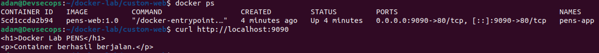

# LAPORAN PRAKTIKUM

## TUGAS 2 — Konsep Container dan Instalasi Docker

**Dosen Pengampu:**
Ferry Astika Saputra

**Disusun Oleh:**
Adam Rasyid Nurmuhammad
3126640025
D4-IT-B

**PROGRAM STUDI SARJANA TERAPAN**
**JURUSAN TEKNIK INFORMATIKA**
**DEPARTEMEN TEKNIK INFORMATIKA DAN KOMPUTER**
**POLITEKNIK ELEKTRONIKA NEGERI SURABAYA**
**2026**

---

## DAFTAR ISI

- [BAB I PENDAHULUAN](#bab-i-pendahuluan)
  - [1.1 Latar Belakang](#11-latar-belakang)
  - [1.2 Tujuan](#12-tujuan)
- [BAB II LANDASAN TEORI](#bab-ii-landasan-teori)
  - [2.1 Containerization](#21-containerization)
  - [2.2 Namespace](#22-namespace)
  - [2.3 Cgroup](#23-cgroup)
  - [2.4 Docker](#24-docker)
- [BAB III PENGERJAAN PRAKTIKUM](#bab-iii-pengerjaan-praktikum)
  - [3.1 Container Nginx dan Ubuntu interaktif](#31-container-nginx-dan-ubuntu-interaktif)
  - [3.2 Dockerfile custom web statis](#32-dockerfile-custom-web-statis)
  - [3.3 Analisis wajib](#33-analisis-wajib)
- [BAB IV KESIMPULAN](#bab-iv-kesimpulan)

---

## BAB I PENDAHULUAN

### 1.1 Latar Belakang

Containerization merupakan teknologi yang memungkinkan aplikasi beserta seluruh dependensinya dikemas dan dijalankan dalam lingkungan yang terisolasi. Salah satu platform yang digunakan untuk menerapkan teknologi tersebut adalah Docker, yang menyediakan mekanisme untuk membuat, menjalankan, dan mengelola container secara konsisten. Docker memanfaatkan konsep seperti image, container, namespace, dan cgroup untuk memberikan isolasi serta pengelolaan resource pada aplikasi. Pemahaman mengenai konsep containerization dan arsitektur Docker menjadi dasar penting sebelum menerapkan container dalam proses pengembangan, deployment, dan penerapan DevSecOps.

### 1.2 Tujuan

1. Menjelaskan perbedaan virtual machine dan container dari sisi isolasi, ukuran, startup time, dan overhead.
2. Mengidentifikasi komponen Docker: client, daemon, registry, image, container, network, dan volume.
3. Menginstal Docker Engine pada Ubuntu serta Docker Desktop pada Windows berbasis WSL2.
4. Menjalankan container pertama, melakukan inspeksi image, melihat log, dan membangun image custom sederhana.

---

## BAB II LANDASAN TEORI

### 2.1 Containerization

Containerization merupakan teknologi yang digunakan untuk menjalankan aplikasi beserta seluruh dependensinya dalam lingkungan yang terisolasi. Dengan container, aplikasi dapat dikemas dalam sebuah image sehingga dapat dijalankan secara konsisten pada berbagai lingkungan tanpa harus menginstal seluruh dependensi secara langsung pada sistem host.

### 2.2 Namespace

Namespace merupakan mekanisme pada sistem operasi Linux yang digunakan untuk memberikan lingkungan terisolasi kepada proses yang berjalan di dalam container. Dengan namespace, container dapat memiliki pandangan tersendiri terhadap berbagai resource sistem seperti proses, filesystem, network, hostname, dan user. Mekanisme ini membuat proses di dalam container seolah-olah berjalan pada lingkungan sistem yang terpisah meskipun sebenarnya masih menggunakan kernel yang sama dengan host.

### 2.3 Cgroup

Control Groups atau cgroup merupakan mekanisme Linux yang digunakan untuk mengatur dan membatasi penggunaan resource oleh sekumpulan proses. Pada container, cgroup dapat digunakan untuk membatasi resource seperti CPU, memori, I/O, dan jumlah proses yang dapat digunakan. Dengan adanya cgroup, penggunaan resource oleh sebuah container dapat dikendalikan sehingga tidak menghabiskan resource host secara berlebihan dan mengganggu container atau proses lainnya.

### 2.4 Docker

Docker merupakan platform yang digunakan untuk membuat, menjalankan, dan mengelola container. Docker menyediakan berbagai komponen seperti Docker Engine, Docker CLI, image, dan container yang memungkinkan proses deployment aplikasi dilakukan secara lebih mudah, konsisten, dan terisolasi.

---

## BAB III PENGERJAAN PRAKTIKUM

### 3.1 Container Nginx dan Ubuntu interaktif

**1. Buat direktori bab 2**


**2. Siapkan key repo Docker**


**3. Menambahkan GPG key Docker**


**4. Tambahkan repository Docker**


**5. Update dan pastikan muncul download.docker.com**


**6. Install Docker Engine**


**7. Tambahkan user dan docker ps**


**8. Verifikasi docker version**

.png)

**9. Docker run hello-world**

.png)

**10. Download Docker image Nginx versi 1.26**


**11. Cek images yang sudah di-download**


**12. Membuat dan menjalankan container berjalan di background menggunakan Nginx**


**13. Cek container dengan `docker ps`**

.png)

**14. Lihat log Nginx**


**15. Tes Nginx menggunakan curl**

.png)

**16. Jalankan Ubuntu sebagai container**


**17. Cek OS dari dalam container**


**18. Hapus container latihan dan cek container kembali**


### 3.2 Dockerfile custom web statis

**19. Membuat image milik kita sendiri**


**20. Buat index.html**


**21. Buat Dockerfile**


Memahami Dockerfile:

```dockerfile
FROM nginx:1.26-alpine
# Gunakan Nginx 1.26 berbasis Alpine sebagai base image.

LABEL maintainer="admin@pens.ac.id"
# Memberikan metadata pada image.

COPY index.html /usr/share/nginx/html/index.html
# Menyalin index.html ke dalam Docker image
# index.html → /usr/share/nginx/html/index.html

EXPOSE 80
# Ini hanya mendokumentasikan bahwa aplikasi menggunakan port 80.

CMD ["nginx", "-g", "daemon off;"]
# Ini menentukan proses utama yang dijalankan ketika container start.
```

**22. Docker build dan docker images**

.png)

**23. Jalankan custom container**


**24. Verifikasi**



**25. Final docker version, docker ps, curl**

.png)

**26. Cuplikan log atau query yang membuktikan sistem bekerja**

.png)

### 3.3 Analisis wajib

**● Jelaskan satu masalah yang muncul dan cara Anda mendiagnosisnya.**

Salah satu masalah yang dapat muncul pada praktikum Docker adalah tidak memiliki permission untuk mengakses Docker daemon ketika menjalankan perintah `docker ps`. Diagnosis dilakukan dengan menjalankan `sudo docker ps`. Jika perintah tersebut berhasil, sedangkan `docker ps` tanpa sudo gagal, maka masalah berada pada permission pengguna terhadap Docker daemon. Selanjutnya dilakukan pengecekan menggunakan perintah `groups` dan pengguna ditambahkan ke group docker menggunakan `sudo usermod -aG docker $USER`. Setelah menjalankan `newgrp docker`, perintah Docker dapat digunakan tanpa sudo.

**● Jelaskan risiko keamanan atau operasional yang relevan pada bab ini.**

**Risiko 1 — Docker group memiliki privilege tinggi**

Risiko keamanan yang relevan adalah penggunaan Docker group yang memberikan akses tinggi terhadap Docker daemon. Jika akun pengguna tersebut disalahgunakan, penyerang berpotensi menjalankan container dengan privilege tinggi dan mengakses resource pada host.

```bash
sudo usermod -aG docker $USER
```

**Risiko 2 — Menjalankan container sebagai root**

Risiko keamanan lainnya adalah menjalankan aplikasi di dalam container menggunakan user root. Jika terdapat vulnerability pada aplikasi atau konfigurasi container, privilege yang tinggi dapat memperbesar dampak serangan terhadap host.

**Risiko 3 — Image memiliki vulnerability**

```bash
docker pull nginx:1.26
```

```dockerfile
FROM nginx:1.26-alpine
```

Penggunaan base image tanpa pemeriksaan vulnerability dapat menyebabkan container membawa package atau library yang memiliki kerentanan keamanan.

**Risiko 4 — Data container tidak otomatis persistent**

Untuk aplikasi production, data penting seharusnya menggunakan volume atau storage eksternal dan memiliki mekanisme backup.

**● Berikan rekomendasi perbaikan bila lab ini akan dibawa ke production-like environment.**

Jika lab ini diterapkan pada production-like environment, penggunaan Docker sebaiknya dilengkapi dengan beberapa pengamanan. Base image harus berasal dari sumber terpercaya, menggunakan versi yang terkontrol, dan dilakukan vulnerability scanning secara berkala. Aplikasi sebaiknya dijalankan menggunakan user non-root dan container diberikan batasan CPU serta memory. Secret seperti password dan API key tidak boleh ditanam langsung pada Dockerfile atau image. Data yang membutuhkan persistence harus menggunakan volume atau storage eksternal serta memiliki mekanisme backup dan restore. Selain itu, pemeriksaan keamanan container sebaiknya diintegrasikan ke dalam CI/CD pipeline sehingga image hanya dapat dideploy setelah melewati pemeriksaan keamanan.

---

## BAB IV KESIMPULAN

Berdasarkan praktikum yang telah dilakukan, dapat disimpulkan bahwa Docker merupakan teknologi containerization yang dapat digunakan untuk menjalankan aplikasi secara terisolasi dan konsisten. Pada praktikum ini telah dilakukan instalasi dan verifikasi Docker Engine, menjalankan container hello-world dan Nginx, melakukan pemetaan port, serta membuat custom Docker image menggunakan Dockerfile. Container kemudian diverifikasi menggunakan `docker ps`, `docker logs`, dan `curl` untuk memastikan aplikasi dapat berjalan dengan baik. Selain memahami penggunaan image, container, Dockerfile, dan network, praktikum ini juga memberikan pemahaman mengenai pentingnya aspek keamanan seperti penggunaan image terpercaya, pembatasan privilege dan resource, serta pengelolaan data dan secret. Pengetahuan yang diperoleh menjadi dasar untuk menerapkan containerization dalam proses CI/CD dan lingkungan DevSecOps yang lebih aman dan terkontrol.
