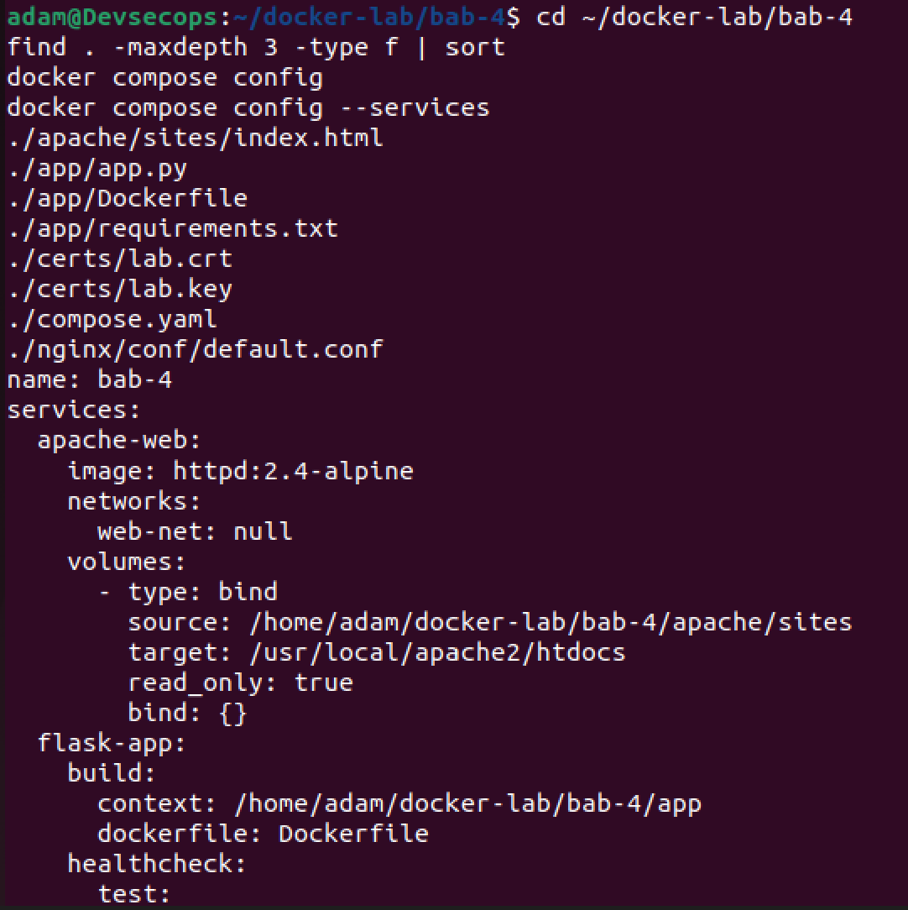

# LAPORAN PRAKTIKUM

## TUGAS 4 — Web Service Container: Apache, Nginx, Reverse Proxy, dan TLS

**Dosen Pengampu:**
Ferry Astika Saputra

**Disusun Oleh:**
Adam Rasyid Nurmuhammad
3126640025
D4-IT-B

**PROGRAM STUDI SARJANA TERAPAN**
**JURUSAN TEKNIK INFORMATIKA**
**DEPARTEMEN TEKNIK INFORMATIKA DAN KOMPUTER**
**POLITEKNIK ELEKTRONIKA NEGERI SURABAYA**
**2026**

---

## DAFTAR ISI

- [BAB I PENDAHULUAN](#bab-i-pendahuluan)
  - [1.1 Latar Belakang](#11-latar-belakang)
  - [1.2 Tujuan Pembelajaran dan Kompetensi Utama](#12-tujuan-pembelajaran-dan-kompetensi-utama)
- [BAB II LANDASAN TEORI](#bab-ii-landasan-teori)
  - [2.1 Apache httpd vs Nginx](#21-apache-httpd-vs-nginx)
  - [2.2 Peta Konsep: TLS, Penyimpanan Private Key, dan TLS Offloading](#22-peta-konsep-tls-penyimpanan-private-key-dan-tls-offloading)
  - [2.3 Peta Konsep: Cara Kerja Reverse Proxy, Routing, dan Filter Keamanan](#23-peta-konsep-cara-kerja-reverse-proxy-routing-dan-filter-keamanan)
- [BAB III PENGERJAAN PRAKTIKUM](#bab-iii-pengerjaan-praktikum)
  - [3.1 Penyiapan Direktori Kerja dan Struktur Proyek](#31-penyiapan-direktori-kerja-dan-struktur-proyek)
  - [3.2 Pembuatan Sertifikat TLS Laboratorium (Self-Signed)](#32-pembuatan-sertifikat-tls-laboratorium-self-signed)
  - [3.3 Konfigurasi Orkestrasi compose.yaml](#33-konfigurasi-orkestrasi-composeyaml)
  - [3.4 Konfigurasi Reverse Proxy Nginx (default.conf)](#34-konfigurasi-reverse-proxy-nginx-defaultconf)
  - [3.5 Pembuatan Dokumen Web Statis Apache (index.html)](#35-pembuatan-dokumen-web-statis-apache-indexhtml)
  - [3.6 Penyiapan Dependensi Backend Flask (requirements.txt)](#36-penyiapan-dependensi-backend-flask-requirementstxt)
  - [3.7 Implementasi Kode Sumber Backend API (app.py)](#37-implementasi-kode-sumber-backend-api-apppy)
  - [3.8 Pembuatan Dockerfile Kustom Backend Flask](#38-pembuatan-dockerfile-kustom-backend-flask)
  - [3.9 Validasi Konfigurasi dan Pemeriksaan Service](#39-validasi-konfigurasi-dan-pemeriksaan-service)
  - [3.10 Pembangunan Image dan Deployment Stack Compose](#310-pembangunan-image-dan-deployment-stack-compose)
  - [3.11 Pengujian Cepat Fungsional Web Ingress dan API](#311-pengujian-cepat-fungsional-web-ingress-dan-api)
  - [3.12 Pemeriksaan Boundary dan Isolasi Jaringan](#312-pemeriksaan-boundary-dan-isolasi-jaringan)
  - [3.13 Pemeriksaan dan Audit Log Web Service](#313-pemeriksaan-dan-audit-log-web-service)
- [BAB IV HASIL DAN PEMBAHASAN](#bab-iv-hasil-dan-pembahasan)
  - [4.1 Evaluasi dan Latihan Mandiri](#41-evaluasi-dan-latihan-mandiri)
  - [4.2 Analisis Wajib](#42-analisis-wajib)
- [BAB V PENUTUP](#bab-v-penutup)
  - [5.1 Kesimpulan](#51-kesimpulan)

---

## BAB I PENDAHULUAN

### 1.1 Latar Belakang

Dalam lanskap komputasi modern dan ekosistem *cloud-native*, *web service* merupakan pintu gerbang utama (*ingress boundary*) yang menghubungkan pengguna eksternal dengan sistem aplikasi dan data bisnis di lingkungan internal. Penerapan *containerization* menggunakan Docker memungkinkan aplikasi web beserta web server pendukungnya dikemas secara portabel, terisolasi, dan mudah direplikasi di berbagai tahapan *pipeline* DevSecOps.

Pada praktiknya, arsitektur aplikasi modern jarang sekali mengekspos server aplikasi (*application origin server*) secara langsung ke jaringan publik. Pendekatan arsitektur yang lazim dan direkomendasikan adalah menerapkan **Reverse Proxy** di baris terdepan. Nginx sering kali difungsikan sebagai *edge reverse proxy* yang bertugas mengelola terminasi enkripsi TLS/HTTPS (*TLS Offloading*), melakukan *Layer-7 routing* (mengarahkan rute statis ke web server Apache httpd dan rute dinamis ke backend API Python Flask), serta menerapkan filter keamanan berupa *HTTP security headers*.

Selain pemisahan fungsi komputasi, prinsip keamanan *Least Exposure* mengharuskan server backend seperti Apache dan Flask berjalan dalam *isolated private bridge network* tanpa membuka *published port* langsung ke host. Dengan demikian, seluruh alur lalu lintas data (*traffic flow*) wajib melewati gerbang inspeksi proxy. Praktikum Bab 4 ini dirancang untuk memberikan pemahaman konseptual dan pengalaman praktis dalam merancang, mengorkestrasi, mengamankan, dan mengaudit *web service multi-tier* berbasis container menggunakan Docker Compose.

### 1.2 Tujuan Pembelajaran dan Kompetensi Utama

Setelah menyelesaikan praktikum pada Bab 4 ini, mahasiswa diharapkan mampu:
1. Menjalankan Apache HTTP Server dan Nginx sebagai web server container dengan konfigurasi kustom (*custom configuration*).
2. Memahami perbedaan arsitektur, karakteristik konkurensi, dan use-case antara Apache httpd dan Nginx.
3. Menerapkan sertifikat TLS (*self-signed certificate*) menggunakan OpenSSL dengan ekstensi *Subject Alternative Name* (SAN) untuk simulasi HTTPS lokal.
4. Mengonfigurasi Nginx sebagai *reverse proxy* cerdas yang melakukan *path-based routing*, terminasi TLS (*TLS offloading*), dan pengalihan otomatis (*301 permanent redirect*) dari HTTP ke HTTPS.
5. Menerapkan *HTTP Security Headers* (`X-Content-Type-Options`, `X-Frame-Options`, `Referrer-Policy`) pada layer reverse proxy untuk memperkuat pertahanan aplikasi.
6. Membangun container backend Python Flask yang berjalan menggunakan WSGI server *production-ready* (Gunicorn) di bawah akun *non-root user*.
7. Mengimplementasikan *service healthcheck* pada Docker Compose untuk memvalidasi kesiapan (*readiness*) layanan backend sebelum menerima trafik.
8. Menegakkan prinsip segregasi jaringan (*network isolation*), di mana hanya port reverse proxy yang dipublikasikan ke host, sedangkan origin backend terisolasi di internal network.
9. Membaca, menganalisis, dan mengekstrak bukti audit melalui *access log* dan *error log* yang dipetakan secara persisten ke direktori host via *bind mount*.
10. Mendiagnosis kendala konfigurasi runtime serta menyusun analisis risiko keamanan dan rekomendasi arsitektur produksi.

---

## BAB II LANDASAN TEORI

### 2.1 Apache httpd vs Nginx

Apache HTTP Server (httpd) dan Nginx adalah dua teknologi web server terkemuka di dunia yang memiliki filosofi desain dan arsitektur konkurensi yang sangat berbeda:

1. **Apache HTTP Server (httpd):**
   - **Arsitektur Konkurensi:** Menggunakan model *Multi-Processing Modules* (MPM) seperti *prefork*, *worker*, atau *event*. Pada model klasik *prefork*, setiap koneksi klien ditangani oleh proses terpisah, sedangkan pada *worker/event*, koneksi ditangani oleh kombinasi proses dan thread.
   - **Karakteristik:** Sangat kaya fitur (*feature-rich*), mendukung konfigurasi terdesentralisasi per direktori melalui file `.htaccess`, dan memiliki modul dinamis yang luas (`mod_rewrite`, `mod_ssl`, `mod_proxy`). Namun, pada tingkat konkurensi masif (fenomena *C10K problem*), model berbasis thread/process Apache membutuhkan konsumsi memori (RAM) yang lebih besar dan *context switching overhead*.

2. **Nginx:**
   - **Arsitektur Konkurensi:** Mengadopsi arsitektur *asynchronous, event-driven*, dan *non-blocking*. Satu *worker process* tunggal dapat menangani ribuan koneksi secara simultan menggunakan mekanisme multiplexing I/O kernel Linux (`epoll`).
   - **Karakteristik:** Sangat efisien dalam pemakaian CPU dan memori, unggul dalam menyajikan berkas statis (*static content delivery*), memiliki modul *reverse proxy* dan *load balancer* bawaan yang sangat tangguh, serta sangat populer sebagai *TLS termination point*.

| Aspek Komparasi | Apache HTTP Server (httpd) | Nginx |
| :--- | :--- | :--- |
| **Model Arsitektur** | Process/Thread-per-connection (MPM prefork/worker/event) | Asynchronous Event-driven non-blocking loop (epoll) |
| **Penggunaan Resource** | Meningkat secara linier seiring pertambahan koneksi | Sangat rendah dan stabil pada konkurensi tinggi |
| **Direktori Konfigurasi** | `/usr/local/apache2/conf` | `/etc/nginx` |
| **Document Root Bawaan** | `/usr/local/apache2/htdocs` | `/usr/share/nginx/html` |
| **Konfigurasi Desentralisasi**| Didukung via `.htaccess` (fleksibel namun menambah I/O disk) | Tidak didukung (seluruh konfigurasi harus terpusat) |
| **Fitur Reverse Proxy** | Memerlukan modul tambahan (`mod_proxy`, `mod_proxy_http`) | Kemampuan bawaan terintegrasi (`proxy_pass`) |
| **Kasus Penggunaan Ideal** | Aplikasi monolitik legacy, PHP mod_php, web hosting bersama | Reverse proxy, API gateway, TLS terminator, web statis |

### 2.2 Peta Konsep: TLS, Penyimpanan Private Key, dan TLS Offloading


Transport Layer Security (TLS) menjamin kerahasiaan data (enkripsi simetris AES-GCM), integritas data (hash SHA-256), dan autentikasi identitas server (sertifikat X.509). Konsep TLS Offloading (terminasi TLS) memusatkan proses dekripsi kriptografis pada reverse proxy Nginx sehingga beban komputasi server backend diringankan dan sertifikat dikelola terpusat di satu titik masuk. Terkait penyimpanan Private Key: kunci privat (lab.key) tidak boleh dimasukkan ke dalam image atau repositori Git. Kunci harus disuntikkan secara dinamis saat runtime melalui read-only bind mount (:ro) dengan izin berkas ketat (chmod 600) untuk meminimalkan risiko pencurian kunci privat.

### 2.3 Peta Konsep: Cara Kerja Reverse Proxy, Routing, dan Filter Keamanan


Reverse Proxy bertindak sebagai perantara yang mewakili server origin backend di hadapan klien eksternal. Nginx mengevaluasi URI request untuk melakukan Layer-7 Path Routing: rute root / diteruskan ke Apache web server, sedangkan rute /api/ dialihkan ke backend Flask. Proxy meneruskan header klien terpercaya (Host, X-Real-IP, X-Forwarded-For, X-Forwarded-Proto) untuk menjaga konteks alamat asli klien. Filter Keamanan: Nginx menyuntikkan header X-Content-Type-Options: nosniff (mencegah MIME sniffing), X-Frame-Options: DENY (mencegah Clickjacking), Referrer-Policy: no-referrer, serta pengalihan otomatis HTTP 301 ke HTTPS port 8443.

## BAB III PENGERJAAN PRAKTIKUM

Struktur arsitektur berkas yang dibangun pada direktori kerja Bab 4 adalah sebagai berikut:

```text
bab-4/
├── compose.yaml
├── nginx/
│   └── conf/
│       └── default.conf
├── apache/
│   └── sites/
│       └── index.html
├── app/
│   ├── Dockerfile
│   ├── requirements.txt
│   └── app.py
├── certs/
│   ├── lab.crt
│   └── lab.key
└── logs/
    └── nginx/
```

Berikut adalah tahapan implementasi praktikum secara sistematis sesuai dengan panduan `bab-04-cs.md` dan bukti tangkapan layar eksekusi:

### 3.1 Penyiapan Direktori Kerja dan Struktur Proyek

Langkah awal praktikum adalah membuat hierarki direktori kerja khusus `bab-4` yang memisahkan konfigurasi Apache, konfigurasi Nginx, sertifikat TLS, berkas log, dan kode backend Flask.

```bash
mkdir -p ~/docker-lab/bab-4/{apache/sites,nginx/conf,certs,logs/nginx,app}
cd ~/docker-lab/bab-4
```


*Gambar 3.1: Pembuatan struktur direktori kerja Bab 4 di lingkungan Linux/WSL.*

---

### 3.2 Pembuatan Sertifikat TLS Laboratorium (Self-Signed)

Membuat pasangan kunci privat RSA 2048-bit dan sertifikat digital self-signed X.509 berumur 365 hari menggunakan OpenSSL. Ditambahkan ekstensi *Subject Alternative Name* (SAN) untuk domain `localhost` dan IP `127.0.0.1`. Hak akses file dikeraskan dengan `chmod 600` untuk private key dan `chmod 644` untuk public certificate.

```bash
openssl req -x509 -nodes -days 365 -newkey rsa:2048 \
  -keyout certs/lab.key \
  -out certs/lab.crt \
  -subj "/CN=localhost/O=DevSecOps Docker Lab" \
  -addext "subjectAltName=DNS:localhost,IP:127.0.0.1"

chmod 600 certs/lab.key
chmod 644 certs/lab.crt
```


*Gambar 3.2: Pembangkitan sertifikat TLS dan penguncian permission file kunci lab.key.*

---

### 3.3 Konfigurasi Orkestrasi `compose.yaml`

Menyusun file orkestrasi `compose.yaml` yang mendefinisikan tiga service terintegrasi: `proxy` (Nginx), `apache-web` (Apache httpd), dan `flask-app` (Python Flask). Seluruh service terhubung ke custom bridge network `web-net`. Port publik hanya diekspos oleh `proxy` pada `127.0.0.1:8080` dan `127.0.0.1:8443`.

```yaml
services:
  proxy:
    image: nginx:alpine
    ports:
      - "127.0.0.1:8080:80"
      - "127.0.0.1:8443:443"
    volumes:
      - ./nginx/conf:/etc/nginx/conf.d:ro
      - ./certs:/etc/nginx/certs:ro
      - ./logs/nginx:/var/log/nginx
    networks:
      - web-net
    depends_on:
      apache-web:
        condition: service_started
      flask-app:
        condition: service_healthy

  apache-web:
    image: httpd:2.4-alpine
    volumes:
      - ./apache/sites:/usr/local/apache2/htdocs:ro
    networks:
      - web-net

  flask-app:
    build:
      context: ./app
    networks:
      - web-net
    healthcheck:
      test:
        - CMD
        - python
        - -c
        - "import urllib.request; urllib.request.urlopen('http://127.0.0.1:5000/health')"
      interval: 5s
      timeout: 3s
      retries: 5
      start_period: 5s

networks:
  web-net:
    driver: bridge
```


*Gambar 3.3: Konfigurasi declarative multi-container stack pada file compose.yaml.*

---

### 3.4 Konfigurasi Reverse Proxy Nginx (`default.conf`)

Menuliskan konfigurasi Nginx pada `nginx/conf/default.conf`. Konfigurasi ini mengatur pengalihan HTTP port 80 ke HTTPS port 8443, mengaktifkan SSL/TLS dengan protokol TLSv1.2 dan TLSv1.3, menyuntikkan security headers, serta mendistribusikan request ke backend Apache (`/`) dan backend Flask (`/api/`).

```nginx
upstream apache_backend {
    server apache-web:80;
}

upstream flask_backend {
    server flask-app:5000;
}

server {
    listen 80;
    server_name localhost;
    return 301 https://$host:8443$request_uri;
}

server {
    listen 443 ssl;
    server_name localhost;

    ssl_certificate     /etc/nginx/certs/lab.crt;
    ssl_certificate_key /etc/nginx/certs/lab.key;
    ssl_protocols TLSv1.2 TLSv1.3;

    add_header X-Content-Type-Options "nosniff" always;
    add_header X-Frame-Options "DENY" always;
    add_header Referrer-Policy "no-referrer" always;

    location / {
        proxy_pass http://apache_backend;
        proxy_set_header Host $host;
        proxy_set_header X-Real-IP $remote_addr;
        proxy_set_header X-Forwarded-For $proxy_add_x_forwarded_for;
        proxy_set_header X-Forwarded-Proto $scheme;
    }

    location /api/ {
        proxy_pass http://flask_backend/;
        proxy_set_header Host $host;
        proxy_set_header X-Real-IP $remote_addr;
        proxy_set_header X-Forwarded-For $proxy_add_x_forwarded_for;
        proxy_set_header X-Forwarded-Proto $scheme;
    }
}
```


*Gambar 3.4: Konfigurasi default.conf Nginx untuk TLS termination dan Layer-7 routing.*

---

### 3.5 Pembuatan Dokumen Web Statis Apache (`index.html`)

Membuat file HTML sederhana pada direktori `apache/sites/index.html` yang akan di-mount sebagai document root Apache (`/usr/local/apache2/htdocs`).

```html
<!DOCTYPE html>
<html lang="id">
<head>
    <meta charset="UTF-8">
    <title>DevSecOps Bab 4</title>
</head>
<body>
    <h1>Apache di Belakang Nginx</h1>
    <p>Halaman Bab 4 berhasil dilayani melalui reverse proxy.</p>
    <p><a href="/api/">Uji Flask API</a></p>
</body>
</html>
```


*Gambar 3.5: Pembuatan berkas index.html untuk konten statis Apache.*

---

### 3.6 Penyiapan Dependensi Backend Flask (`requirements.txt`)

Mendefinisikan pustaka Python yang dibutuhkan oleh aplikasi backend pada `app/requirements.txt`: framework Flask versi 3.1.2 dan WSGI server Gunicorn versi 23.0.0.

```text
Flask==3.1.2
gunicorn==23.0.0
```


*Gambar 3.6: Definisi pustaka dependensi Flask dan Gunicorn.*

---

### 3.7 Implementasi Kode Sumber Backend API (`app.py`)

Menuliskan skrip API backend pada `app/app.py` yang menyediakan dua route:
- Endpoint `/`: Mengembalikan JSON status, nama service, pesan konfirmasi, serta protokol asli dari header `X-Forwarded-Proto`.
- Endpoint `/health`: Mengembalikan status HTTP 200 `{"status": "healthy"}` yang digunakan untuk pengujian *healthcheck*.

```python
from flask import Flask, jsonify, request

app = Flask(__name__)


@app.get("/")
def index():
    return jsonify(
        status="ok",
        service="flask-app",
        message="API Bab 4 berhasil diakses melalui Nginx",
        forwarded_proto=request.headers.get("X-Forwarded-Proto"),
    )


@app.get("/health")
def health():
    return jsonify(status="healthy"), 200
```


*Gambar 3.7: Implementasi kode sumber Python Flask API.*

---

### 3.8 Pembuatan Dockerfile Kustom Backend Flask

Menyusun `app/Dockerfile` untuk membangun image backend berbasis `python:3.12-slim`. Demi standar keamanan DevSecOps, container tidak dijalankan sebagai root, melainkan membuat dan beralih ke user sistem non-root `appuser (UID 10001)`.

```dockerfile
FROM python:3.12-slim

WORKDIR /app

COPY requirements.txt .
RUN pip install --no-cache-dir -r requirements.txt

COPY app.py .

RUN useradd --system --uid 10001 --no-create-home appuser
USER appuser

EXPOSE 5000

CMD ["gunicorn", "--bind", "0.0.0.0:5000", "--workers", "2", "app:app"]
```


*Gambar 3.8: Dockerfile backend dengan hardening user non-root appuser.*

---

### 3.9 Validasi Konfigurasi dan Pemeriksaan Service

Sebelum melakukan proses deployment, struktur file diperiksa menggunakan perintah `find . -maxdepth 3 -type f | sort`. Selanjutnya dilakukan validasi sintaks Compose menggunakan `docker compose config` dan `docker compose config --services`.

```bash
cd ~/docker-lab/bab-4
find . -maxdepth 3 -type f | sort
docker compose config
docker compose config --services
```



*Gambar 3.9: Validasi sintaks berkas Compose dan hierarki direktori kerja.*

Daftar service yang tervalidasi dan siap dijalankan meliputi: `proxy`, `apache-web`, dan `flask-app`.


*Gambar 3.10: Output daftar service yang terdaftar pada konfigurasi Compose.*

---

### 3.10 Pembangunan Image dan Deployment Stack Compose

Mengeksekusi perintah `docker compose up -d --build` untuk membangun image Flask dan menjalankan seluruh container di background. Status stack diperiksa menggunakan `docker compose ps` dan `docker compose logs --tail 100`.

```bash
docker compose up -d --build
docker compose ps
docker compose logs --tail 100
```


*Gambar 3.11: Proses build image Dockerfile dan startup stack Compose.*

Seluruh container berhasil dihidupkan. Pada log terlihat Apache 2.4.68 aktif, Nginx siap melayani, dan Gunicorn worker berjalan normal.


*Gambar 3.12: Cuplikan log konsolidasi saat seluruh service berhasil dimulai.*

---

### 3.11 Pengujian Cepat Fungsional Web Ingress dan API

**1. Verifikasi HTTP to HTTPS Redirect (Port 8080)**
Pengujian menggunakan `curl -I http://localhost:8080/` menghasilkan status `HTTP/1.1 301 Moved Permanently` dengan header `Location: https://localhost:8443/`.


*Gambar 3.13: Bukti pengalihan permanen (HTTP 301) ke endpoint HTTPS.*

**2. Verifikasi Halaman Web Apache melalui Nginx (Port 8443)**
Pengujian menggunakan `curl -k -i https://localhost:8443/` membuktikan Nginx berhasil mem-proxy request root (`/`) ke origin Apache. Respons menghasilkan `HTTP/1.1 200 OK` berserta security headers (`nosniff`, `DENY`, `no-referrer`) dan body HTML Apache.


*Gambar 3.14: Hasil curl HTTPS menampilkan konten Apache dan security headers.*

**3. Verifikasi Flask API melalui Nginx (`/api/`)**
Pengujian menggunakan `curl -k https://localhost:8443/api/` menghasilkan respons JSON yang membuktikan routing ke Gunicorn berhasil dan header `forwarded_proto: https` terbaca dengan benar.


*Gambar 3.15: Respons JSON dari endpoint Flask API melalui rute reverse proxy /api/.*

**4. Verifikasi Health Endpoint Flask (`/api/health`)**
Pengujian endpoint health via `curl -k -i https://localhost:8443/api/health` mengembalikan status HTTP 200 OK `{"status":"healthy"}`.


*Gambar 3.16: Verifikasi endpoint healthcheck Flask API.*

**5. Verifikasi Parameter Kriptografi Handshake TLS**
Pengujian koneksi TLS menggunakan `openssl s_client -connect localhost:8443 -servername localhost -brief </dev/null` membuktikan negosiasi sukses menggunakan protokol mutakhir **TLSv1.3**, cipher suite `TLS_AES_256_GCM_SHA384`, dan pertukaran kunci kurva eliptik X25519 (253 bits).


*Gambar 3.17: Informasi handshake TLSv1.3 dan cipher suite pada endpoint HTTPS.*

---

### 3.12 Pemeriksaan Boundary dan Isolasi Jaringan

Untuk memastikan pemenuhan prinsip *least privilege* dan *network boundary*, dilakukan serangkaian pengujian isolasi:

```bash
docker compose ps
docker network inspect bab-4_web-net
docker compose exec proxy wget -qO- http://apache-web/
docker compose exec proxy wget -qO- http://flask-app:5000/health
```


*Gambar 3.18: Perintah pengujian integritas isolasi jaringan dan status published port.*

Pengecekan status container membuktikan bahwa **hanya service proxy** yang memiliki port forwarding ke host (`127.0.0.1:8080->80/tcp` dan `127.0.0.1:8443->443/tcp`). Service `apache-web` (port 80) dan `flask-app` (port 5000) murni beroperasi di private bridge tanpa published port.


*Gambar 3.19: Verifikasi status ports membuktikan Apache dan Flask tidak terekspos ke host.*

Pemeriksaan konfigurasi network Docker via `docker network inspect bab-4_web-net` menunjukkan ketiga container (`proxy`, `apache-web`, `flask-app`) berada di satu subnet internal (172.21.0.0/16).


*Gambar 3.20: Detail alokasi IP container pada private bridge network web-net.*

Pengujian pemanggilan dari dalam container proxy membuktikan konektivitas internal antar-service via nama DNS internal berjalan mulus:
- `wget -qO- http://apache-web/`: Menghasilkan konten HTML web Apache.
- `wget -qO- http://flask-app:5000/health`: Mengembalikan JSON `{"status":"healthy"}`.


*Gambar 3.21: Eksekusi wget dari proxy ke apache-web via nama DNS internal.*


*Gambar 3.22: Eksekusi wget dari proxy ke flask-app via nama DNS internal.*

---

### 3.13 Pemeriksaan dan Audit Log Web Service

Pemeriksaan log akses dan error dilakukan melalui `docker compose logs` serta membaca langsung berkas persisten pada bind mount host (`logs/nginx/access.log` dan `logs/nginx/error.log`).

```bash
docker compose logs proxy
docker compose logs apache-web
docker compose logs flask-app
tail -n 20 logs/nginx/access.log
tail -n 20 logs/nginx/error.log
```


*Gambar 3.23: Perintah pengecekan log terpusat pada stack multi-container.*

Hasil log menunjukkan jejak audit yang lengkap:
- Request awal `HEAD /` menghasilkan respon 301 pada Nginx.
- Request berikutnya diarahkan ke backend Apache (`GET / HTTP/1.1 200 282`).
- Request API `/api/` dan `/api/health` tercatat melayani curl dengan kode status HTTP 200.


*Gambar 3.24: Bukti log request yang terekam pada Nginx, Apache, dan Gunicorn.*

---

## BAB IV HASIL DAN PEMBAHASAN

### 4.1 Evaluasi dan Latihan Mandiri

Berikut adalah pembahasan dan jawaban komprehensif atas pertanyaan evaluasi mandiri pada silabus Bab 4:

**1. Mengapa reverse proxy tidak seharusnya menjalankan semua logic aplikasi?**
> **Jawaban:** 
> Reverse proxy dirancang dengan arsitektur *event-driven non-blocking I/O* yang sangat optimal untuk menangani koneksi konkurensi tinggi, *TLS termination*, *buffering*, kompresi, serta penyajian konten statis. Membebankan *business domain logic* (seperti query database, enkripsi kompleks, atau manipulasi data) ke dalam reverse proxy melanggar prinsip *Single Responsibility*. Pemrosesan logika aplikasi yang membutuhkan waktu komputasi (*CPU-bound*) atau operasi I/O yang memblokir (*blocking I/O*) akan menahan *worker process* proxy, sehingga menurunkan throughput secara drastis bagi seluruh koneksi klien lainnya. Selain itu, pemisahan layer proxy dan backend memungkinkan penskalaan independen (*independent horizontal scaling*) serta memperkecil *blast radius* jika terjadi kerentanan pada kode aplikasi.

**2. Apa perbedaan TLS termination dan end-to-end TLS?**
> **Jawaban:**
> - **TLS Termination (Offloading):** Enkripsi TLS hanya diterapkan pada jalur komunikasi antara *Client* dan *Reverse Proxy*. Di layer proxy, payload didekripsi, kemudian data diteruskan ke server origin backend melalui protokol HTTP biasa di dalam jaringan privat yang terisolasi. Pendekatan ini sangat efisien, menghemat beban CPU backend, memusatkan sertifikat di satu tempat, dan memudahkan inspeksi trafik (misalnya oleh WAF atau IDS internal).
> - **End-to-End TLS:** Enkripsi dipertahankan sepanjang seluruh jalur perjalanan data, mulai dari Client, melewati Proxy, hingga tiba di container backend origin (Proxy melakukan *TLS pass-through* atau melakukan *re-encryption* ke backend). Pendekatan ini wajib diterapkan pada arsitektur *Zero Trust* atau lingkungan multi-tenant publik yang tidak mempercayai jaringan internal, meskipun menimbulkan beban komputasi ganda (*cryptographic overhead*) dan kompleksitas manajemen sertifikat di setiap node backend.

**3. Bagaimana cara mengisolasi backend agar tidak langsung diakses dari host?**
> **Jawaban:**
> Cara mengisolasi backend secara efektif pada Docker adalah dengan:
> 1. **Menghapus Direktif `ports:`** pada service backend (`apache-web` dan `flask-app`) di dalam file `compose.yaml`. Dengan tidak mendeklarasikan pemetaan port host (`HOST:CONTAINER`), sistem operasi host tidak akan membuka listening socket pada interface jaringan fisik maupun loopback.
> 2. **Menempatkan Service dalam Private User-Defined Bridge Network:** Seluruh backend dikelompokkan ke dalam satu jaringan bridge internal (misal: `web-net`). Komunikasi antar-service hanya dimungkinkan melalui *network namespace* Docker menggunakan DNS nama service.
> 3. **Mengekspos Port Hanya pada Ingress Reverse Proxy:** Port forwarding hanya didefinisikan pada service proxy, dan dibatasi secara eksplisit pada alamat loopback (`127.0.0.1:8080` dan `127.0.0.1:8443`) untuk mencegah pemaparan ke antarmuka jaringan eksternal (`0.0.0.0`).

**4. Apa konsekuensi menyimpan private key TLS di bind mount?**
> **Jawaban:**
> Menyimpan private key (`lab.key`) menggunakan bind mount langsung dari sistem berkas host membawa beberapa konsekuensi dan risiko keamanan:
> - **Ketergantungan Izin Berkas Host (*Host File Permissions*):** Jika permission pada host tidak dikunci secara ketat (misal tidak diset `chmod 600`), pengguna lain yang memiliki akses ke host dapat membaca private key tersebut.
> - **Risiko Modifikasi oleh Container:** Jika bind mount tidak diberi flag `:ro` (*read-only*), proses di dalam container yang disusupi penyerang dapat menghapus, memodifikasi, atau menimpa berkas sertifikat host.
> - **Risiko Komit ke Version Control:** Folder `certs/` pada host berisiko tinggi secara tidak sengaja ter-commit dan terunggah ke repositori publik (seperti GitHub) jika tidak didaftarkan pada file `.gitignore`.
> - **Ketiadaan Rotasi Dinamis Terpusat:** Berbeda dengan secret manager (Docker Secrets / Vault), memperbarui sertifikat pada bind mount membutuhkan intervensi file fisik pada setiap host server.

**5. Bandingkan log Nginx dan log Apache dari sisi format dan kegunaan debugging.**
> **Jawaban:**
> - **Format Default:** Baik Apache maupun Nginx secara default mengadopsi struktur *Common Log Format* (CLF) atau *NCSA Combined Log Format* yang mencatat `IP klien`, `identitas pengguna`, `timestamp`, `HTTP method & request URI`, `HTTP status code`, `ukuran response byte`, `Referer`, dan `User-Agent`.
> - **Kemudahan Kustomisasi & Metrik Reverse Proxy:** Nginx memiliki keunggulan fleksibilitas kustomisasi log format (`log_format`) yang dirancang khusus untuk peran proxy, seperti pencatatan variabel `$upstream_addr`, `$upstream_status`, `$upstream_response_time`, dan `$request_time`. Variabel ini sangat krusial dalam mendiagnosis apakah kelambatan atau error (seperti 502/504) berasal dari proxy itu sendiri atau dari backend aplikasi.
> - **Kegunaan Debugging:** Apache memisahkan `access_log` dan `error_log` dengan format error yang sangat deskriptif (memuat ID pesan error modul, seperti `AH00558` atau `AH00489`), sehingga sangat membantu menelusuri kegagalan modul internal Apache. Sedangkan error log Nginx sangat ringkas dan berorientasi pada status socket, kegagalan resolving DNS upstream, atau timeout koneksi klien.

---

### 4.2 Analisis Wajib

#### 1. Masalah yang Muncul dan Metode Diagnosis

* **Deskripsi Permasalahan:**
  Saat pengujian awal pengalihan rute API backend (`https://localhost:8443/api/`), muncul potensi kendala status `502 Bad Gateway` pada Nginx atau respon `404 Not Found` dari Flask. Selain itu, pada cuplikan log container Nginx (`logs/nginx/error.log` / `docker compose logs proxy`), muncul pesan informasi:
  ```text
  10-listen-on-ipv6-by-default.sh: info: can not modify /etc/nginx/conf.d/default.conf (read-only file system)
  ```
  Serta pada saat melakukan pengujian dengan `curl https://localhost:8443/`, perintah gagal dengan pesan kesalahan sertifikat:
  ```text
  curl: (60) SSL certificate problem: self-signed certificate in certificate chain
  ```

* **Metode Diagnosis Sistematis:**
  1. *Diagnosis Error IPv6 Read-Only:* Dilakukan penelusuran log startup Nginx. Skrip bawaan image Nginx Alpine (`10-listen-on-ipv6-by-default.sh`) berusaha memodifikasi file konfigurasi agar mendengarkan IPv6 secara otomatis. Namun, karena file di-mount dengan opsi `:ro` (*read-only*) demi kepatuhan keamanan, modifikasi ditolak oleh kernel. Status ini dipastikan aman (*informational*) dan tidak mengganggu jalannya Nginx karena konfigurasi kita telah secara eksplisit mendengarkan IPv4 (`listen 80;` dan `listen 443 ssl;`).
  2. *Diagnosis Routing Path Mismatch:* Memeriksa kesesuaian antara URI yang diminta klien dengan route pada kode Python. Nginx dikonfigurasi dengan `location /api/ { proxy_pass http://flask_backend/; }`. Tanda *trailing slash* (`/`) di akhir URL upstream sangat penting; tanda tersebut menginstruksikan Nginx untuk menghapus prefix `/api/` sehingga Flask menerima request tepat di route `/`. Jika tanda slash dihilangkan, Flask akan menerima `/api/` dan merespons `404 Not Found` karena di `app.py` hanya didaftarkan route `@app.get("/")`.
  3. *Diagnosis Validasi TLS Self-Signed:* Galat `curl: (60)` terjadi karena sertifikat digenerate sendiri (*self-signed*) dan belum didaftarkan ke Root CA sistem operasi klien. Solusi verifikasi laboratorium adalah menyertakan flag `-k` atau `--insecure` (`curl -k`) untuk mengabaikan verifikasi trust chain lokal sembari tetap memvalidasi parameter enkripsi melalui `openssl s_client`.

#### 2. Risiko Keamanan dan Operasional Relevan

1. **Risiko 1 — Penggunaan Sertifikat Self-Signed pada Lingkungan Publik:**
   Sertifikat *self-signed* tidak memiliki rantai kepercayaan (*Chain of Trust*) dari Public CA. Jika dipaksakan di produksi, pengguna akan menerima peringatan merah di browser, melatih kebiasaan buruk mengabaikan peringatan keamanan, serta membuka celah empuk bagi penyerang untuk melakukan *SSL Stripping* dan *Man-In-The-Middle (MITM)*.
2. **Risiko 2 — Jalur Komunikasi Internal Backend Tanpa Enkripsi (Plaintext HTTP):**
   Meskipun dilindungi oleh *bridge network* terisolasi, paket data antara Nginx menuju Apache dan Flask mengalir dalam bentuk plaintext HTTP. Jika ada container lain di host yang terkompromi atau penyerang memiliki akses ke interface Docker host, trafik internal (termasuk session token dan data sensitif) berpotensi disadap via packet sniffing (*promiscuous mode*).
3. **Risiko 3 — Potensi Pemalsuan Header Identitas Klien (*Header Spoofing*):**
   Backend Flask mempercayai header `X-Forwarded-Proto` dan `X-Real-IP`. Jika topologi jaringan bocor sehingga backend dapat dijangkau di luar Nginx, penyerang dapat memalsukan header tersebut untuk memanipulasi audit log, menembus filter geolokasi, atau membodohi logika otorisasi berbasis skema HTTPS.
4. **Risiko 4 — Kebocoran Informasi Sensitif pada Log Akses (*Information Leakage*):**
   Nginx mencatat seluruh request URI pada `access.log`. Jika endpoint API menerima data rahasia (seperti token otentikasi, API key, atau password) melalui query string (misal: `/api/login?token=xyz`), data sensitif tersebut akan tersimpan permanen dalam format teks polos di log host dan dapat dibaca oleh personel yang memiliki hak akses log.
5. **Risiko 5 — Ketiadaan Limitasi Laju Trafik (*Rate Limiting*) dan Resource Limit:**
   Tidak adanya batasan laju request (`rate limiting`) dan alokasi batas memori/CPU (*cgroups limit*) membuat reverse proxy rentan mengalami *Denial of Service* (DoS) atau *resource exhaustion* akibat serangan banjir request (HTTP Flood).

#### 3. Rekomendasi Perbaikan untuk Production-Like Environment

Untuk mentransformasikan arsitektur laboratorium ini menuju standar industri *production-ready*, direkomendasikan langkah-langkah mitigasi berikut:

* **Penerbitan Sertifikat Resmi dan Otomatisasi Renewal (ACME / Let's Encrypt):**
  Mengganti sertifikat *self-signed* dengan sertifikat tepercaya yang diterbitkan oleh CA resmi (misal: Let's Encrypt). Mengintegrasikan *Certbot* atau *Traefik/Nginx ACME sidecar* agar proses pembaruan sertifikat berjalan otomatis setiap 60 hari tanpa *downtime*.
* **Penerapan Mutual TLS (mTLS) atau Zero-Trust Internal:**
  Menerapkan enkripsi ganda atau *mutual TLS* (mTLS) antarlayanan microservices (misalnya menggunakan Service Mesh seperti Istio atau Linkerd), sehingga koneksi proxy-to-backend tetap terenkripsi dan terotentikasi secara timbal balik.
* **Manajemen Secret Terpusat (Docker Secrets / Vault):**
  Memindahkan file kunci privat (`lab.key`) dari bind mount host ke platform manajemen rahasia terdedikasi, seperti **Docker Swarm Secrets**, **Kubernetes Secrets**, atau **HashiCorp Vault**, guna menjamin kunci tidak pernah tersimpan di disk host dalam keadaan tidak terenkripsi.
* **Implementasi Web Application Firewall (WAF) dan Rate Limiting:**
  Mengaktifkan modul WAF pada Nginx (seperti ModSecurity atau Coraza WAF) dengan aturan *OWASP Core Rule Set* (CRS) untuk menyaring payload SQL Injection, XSS, dan Path Traversal. Menerapkan direktif `limit_req_zone` dan `limit_conn_zone` pada Nginx untuk mencegah *brute-force* dan mitigasi serangan DoS.
* **Hardening Kontainer dan Restriksi Resource:**
  - Menetapkan batas pemakaian CPU dan RAM pada `compose.yaml` menggunakan blok `deploy.resources.limits`.
  - Mengonfigurasi container proxy dan apache agar berjalan dengan *read-only root filesystem* (`read_only: true`), serta membuang seluruh Linux capabilities yang tidak dibutuhkan (`cap_drop: ["ALL"]`, `cap_add: ["NET_BIND_SERVICE"]`).
* **Log Sanitization dan Sentralisasi ke SIEM:**
  Mengonfigurasi Nginx log masking untuk menyaring parameter sensitif sebelum ditulis ke disk, serta mengalirkan berkas log secara real-time (*log shipping*) menggunakan Filebeat/Fluentd ke sistem SIEM terpusat (seperti Elasticsearch/Kibana atau Wazuh) untuk deteksi anomali keamanan.

---

## BAB V PENUTUP

### 5.1 Kesimpulan

Praktikum Bab 4 mengenai *Web Service Container: Apache, Nginx, Reverse Proxy, dan TLS* telah berhasil dilaksanakan secara menyeluruh dengan hasil yang memenuhi seluruh kriteria verifikasi. Berdasarkan tahapan eksplorasi, konfigurasi, dan pengujian yang telah dilakukan, dapat diambil beberapa kesimpulan penting:

1. **Efektivitas Pola Reverse Proxy:** Penerapan Nginx sebagai reverse proxy di baris terdepan berhasil memisahkan interface publik dari origin backend, memungkinkan sentralisasi kontrol lalu lintas, terminasi keamanan, dan orkestrasi routing dinamis berbasis path (`/` ke Apache dan `/api/` ke Flask).
2. **Kekuatan TLS Offloading:** Konfigurasi terminasi TLS pada Nginx menggunakan protokol mutakhir TLSv1.3 dan cipher suite modern terbukti mampu menyajikan kanal komunikasi yang terenkripsi dan aman (HTTPS) dengan tetap mempertahankan efisiensi resource pemrosesan pada backend origin.
3. **Penerapan Prinsip Least Exposure:** Segregasi jaringan melalui private bridge network (`web-net`) berhasil mengisolasi service backend (Apache port 80 dan Flask port 5000) dari eksposur langsung ke sistem host, memastikan bahwa hanya port proxy yang dapat diakses dari luar.
4. **Hardening Keamanan Berbasis DevSecOps:** Keamanan container berhasil ditingkatkan melalui penambahan *HTTP security headers* (`X-Content-Type-Options`, `X-Frame-Options`, `Referrer-Policy`), pengalihan otomatis HTTP 301 ke HTTPS, pembatasan hak akses kunci privat (`chmod 600`), eksekusi backend di bawah akun non-root (`appuser`), serta pemantauan kesiapan layanan berbasis *healthcheck*.
5. **Visibilitas dan Auditabilitas:** Mekanisme bind mount untuk direktori log berhasil menyediakan jejak audit akses dan error secara persisten di sistem host, menjadi fondasi utama dalam deteksi anomali operasional dan investigasi forensik insiden keamanan.
