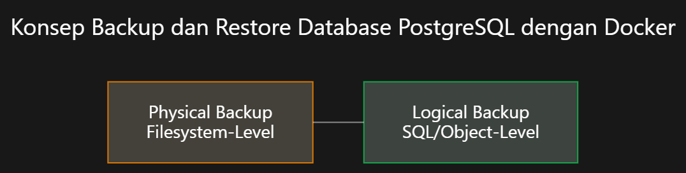
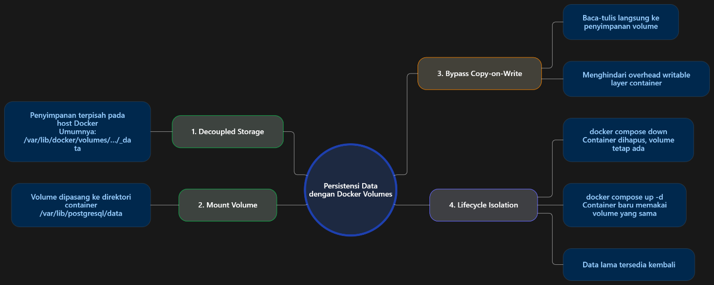
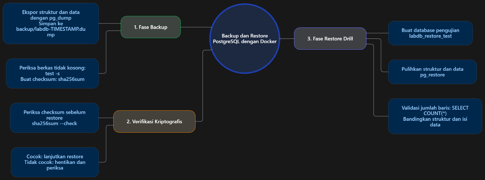
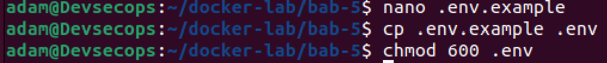
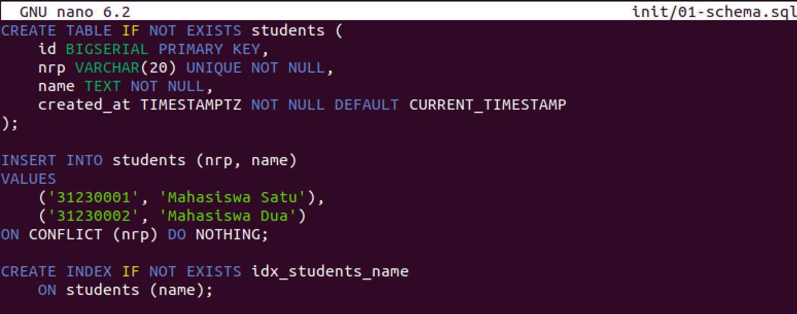
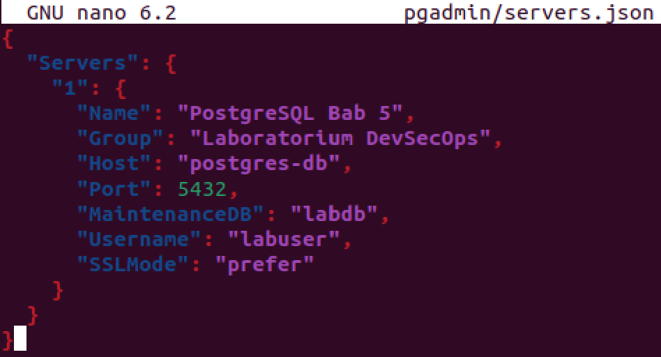
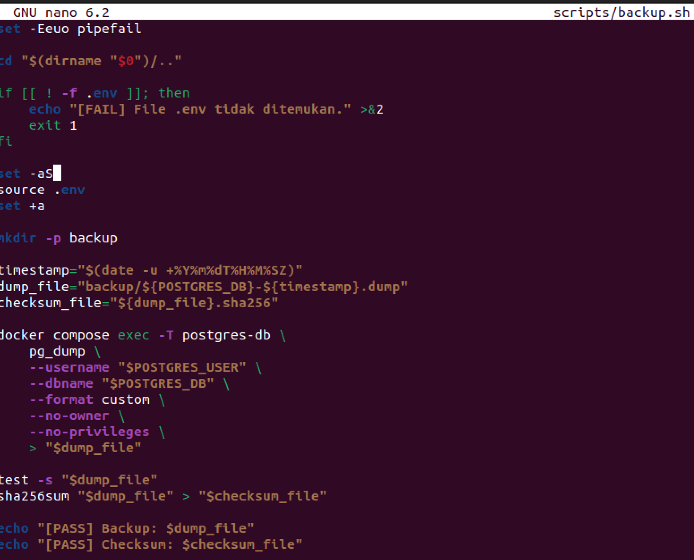
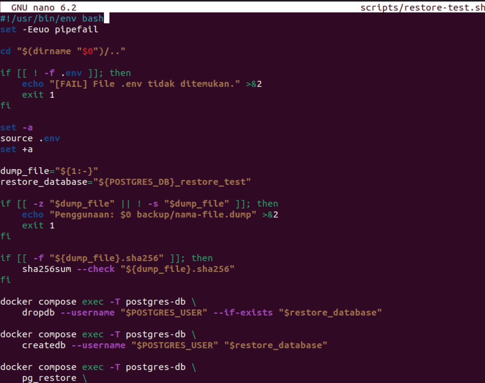
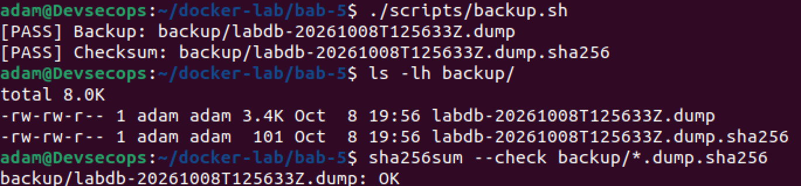

# LAPORAN PRAKTIKUM
## TUGAS 5 Database Container: PostgreSQL, pgAdmin, Volume, Backup, dan Restore

**Dosen Pengampu :** Ferry Astika Saputra

---

### Disusun Oleh :
**Nama :** Adam Rasyid Nurmuhammad  
**NRP :** 3126640025  
**Kelas :** D4-IT-B  

**PROGRAM STUDI SARJANA TERAPAN**  
**JURUSAN TEKNIK INFORMATIKA**  
**DEPARTEMEN TEKNIK INFORMATIKA DAN KOMPUTER**  
**POLITEKNIK ELEKTRONIKA NEGERI SURABAYA**  
**2026**

---

# BAB I
# PENDAHULUAN

## Latar Belakang

Dalam era arsitektur cloud-native dan ekosistem microservices modern, kontainerisasi menggunakan Docker telah menjadi bagian penting dalam aplikasi karena menjamin portabilitas, isolasi sumber daya, dan kemudahan deployment. Segala modifikasi berkas yang dilakukan di dalam container layer akan down saat siklus hidup kontainer berakhir (restart, update, atau destroy). Karakteristik ini menjadi tantangan besar ketika mengoperasikan sistem (RDBMS) seperti PostgreSQL yang bersifat stateful dan menuntut penyimpanan data secara permanen.

Untuk mengatasi keterbatasan tersebut, Docker menyediakan mekanisme persistensi penyimpanan eksternal, khususnya Docker Named Volumes. Melalui named volume, direktori basis data (`/var/lib/postgresql/data`) dipindahkan ke area penyimpanan host yang dikelola oleh Docker Engine. Hal ini memungkinkan data tetap persisten melintasi siklus hidup kontainer. Namun demikian, persistensi volume saja belum mencukupi standar ketahanan DevSecOps. Kerusakan disk, serangan ransomware, korupsi data, hingga human error tetap dapat merusak sistem. Oleh karena itu, prosedur pencadangan (backup) berbasis `pg_dump`, verifikasi keaslian kriptografis SHA-256, menjadi keharusan mutlak Pembangunan system berkelanjutan.

---

# BAB II
# LANDASAN TEORI

## Konsep Backup dan Restore Database PostgreSQL dengan Docker

Pencadangan (backup) merupakan tindakan menyalin kondisi basis data ke media penyimpanan terpisah, sedangkan pemulihan (restore) merupakan rekonstruksi basis data ke status operasional konsisten pasca terjadinya insiden. Pada PostgreSQL yang berjalan di kontainer Docker, pendekatan pencadangan terbagi menjadi dua kategori utama:



1. **Physical Backup (Filesystem-Level):** Menyalin seluruh direktori fisik `$PGDATA` secara biner. Kelemahan pendekatan ini adalah ukuran file sangat besar, terikat kaku pada arsitektur OS dan versi mayor PostgreSQL yang identik, serta memerlukan WAL archiving atau penghentian database agar tidak corrupt.
2. **Logical Backup (SQL/Object-Level):** Mengekstrak skema DDL dan data DML menggunakan utilitas bawaan PostgreSQL `pg_dump`. Mekanisme ini membaca snapshot transaksional secara non-blocking (zero downtime).

---

## Peta Konsep: Bagaimana cara kerja persistensi data dengan Docker volumes?



1. **Decoupled Storage:** Docker membuat direktori penyimpanan khusus pada filesystem host di `/var/lib/docker/volumes/<volume_name>/_data`.
2. **VFS Namespace Mount:** Engine Docker me-mount direktori host tersebut langsung ke direktori target di dalam kontainer (`/var/lib/postgresql/data`).
3. **Bypass Copy-on-Write:** Operasi tulis-baca langsung dialirkan ke disk host tanpa melalui overhead layer kontainer, menghasilkan performa I/O native.
4. **Lifecycle Isolation:** Saat kontainer dihentikan atau dihancurkan (`docker compose down`), volume tetap dipertahankan. Saat kontainer dinyalakan kembali, kontainer baru langsung mengaitkan kembali volume yang sama.

---

## Peta Konsep: Backup dan Restore PostgreSQL dengan Docker



1. **Fase Backup:** Perintah `docker compose exec -T postgres-db pg_dump` mengalirkan data biner secara streaming keluar kontainer langsung ke berkas host `backup/labdb-TIMESTAMP.dump`. Host memvalidasi bahwa berkas tidak nol byte (`test -s`) dan segera menghitung digest SHA-256 (`sha256sum`).
2. **Fase Verifikasi Kriptografis:** Sebelum restorasi dimulai, `sha256sum --check` dijalankan untuk memastikan berkas terbebas dari silent bit rot atau perubahan tidak sah.
3. **Fase Restore Drill:** Database baru `labdb_restore_test` dibuat pada kontainer, utilitas `pg_restore` mengeksekusi rekonstruksi struktur dan record data, lalu kueri validasi `SELECT COUNT(*)` memastikan seluruh data pulih sempurna 100%.

---

# BAB III
# PENGERJAAN PRAKTIKUM

## Persiapan Direktori Bab 5

Menyiapkan tata kelola direktori kerja proyek laboratorium agar struktur berkas terpisah secara rapi:

```bash
mkdir -p ~/docker-lab/bab-5/{init,backup,pgadmin,scripts}
cd ~/docker-lab/bab-5
```


---

## Pembuatan File Konfigurasi Laboratorium

### A. Script 1 — File .env.example (Template Konfigurasi Lingkungan):



### B. Script 2 — File .gitignore (Pencegahan Kebocoran Kredensial dan Dump):


### C. Script 3 — File compose.yaml (Multi-Container Stack PostgreSQL & pgAdmin):


### D. Script 4 — File init/01-schema.sql (Inisialisasi Tabel dan Data Awal Mahasiswa):



### E. Script 5 — File pgadmin/servers.json (Pendaftaran Server Otomatis pada pgAdmin):



### F. Script 6 — File scripts/backup.sh (Otomasi Logical Backup dan SHA-256 Digest):



### G. Script 7 — File scripts/restore-test.sh (Otomasi Uji Pemulihan Bencana):



---

## Permission dan Validasi File

Memberikan hak akses eksekusi pada skrip Bash dan memvalidasi konfigurasi Docker Compose:


---

## Menjalankan Stack dan Akses pgAdmin

Menjalankan stack secara background, memantau hingga healthy, dan mengakses dashboard pgAdmin pada browser:


---

## Pengujian Schema dan Data Awal

Menguji tabel students dan dua record data awal hasil inisialisasi volume:


---

## Pengujian Persistensi Volume Docker

Menyisipkan record ketiga (Mahasiswa Tiga), merecreate container dengan down lalu up -d, membuktikan data tetap persisten:


---

## Prosedur Pembuatan Backup dan Checksum

Mengeksekusi skrip backup.sh, menghasilkan file dump biner terkompresi dan memverifikasi checksum SHA-256 (OK):



---

## Prosedur Disaster Recovery dan Restore Test

Menjalankan skrip restore-test.sh ke basis data uji labdb_restore_test dan mengonfirmasi integritas data mahasiswa:


---

## Monitoring Dasar Container dan Volume

Melakukan inspeksi resource, log transaksi, pg_isready, serta penggunaan disk volume:


---

## Prosedur Cleanup Database Uji dan Stack

Menghapus database hasil restore test dan mematikan layanan secara aman tanpa menghilangkan volume data:


---

# BAB IV
# HASIL DAN PEMBAHASAN

## Evaluasi dan Latihan Mandiri

**Mengapa init script tidak dijalankan ulang saat volume lama masih ada?**

**Jawab:**  
Saat volume lama masih ada, entrypoint mendeteksi bahwa basis data sudah terinisialisasi. Untuk mencegah data corruption atau kegagalan konflik kunci unik, entrypoint secara sengaja melewati (skip) direktori inisialisasi tersebut. Untuk pembaruan skema di lingkungan produksi, harus digunakan mekanisme migrasi skema (seperti Flyway atau Prisma).

---

**Apa risiko meletakkan password database pada docker-compose.yml?**

**Jawab:**  
Risiko meletakkan password pada docker-compose.yml adalah berkas compose dilacak oleh git dapat memungkinkan terunggah ke repositori publik. Metadata environment tersimpan dalam engine Docker dan dapat dibaca oleh siapa pun pengguna lokal via docker inspect. Selanjutnya, Kredensial dapat tercetak pada log automasi pipeline atau terbaca pada `/proc/<PID>/environ` di host.

---

**Bagaimana cara membuktikan backup dapat dipulihkan?**

**Jawab:**  
Backup dapat dibuktikan bisa dipulihkan dengan melakukan uji restore ke database terpisah menggunakan `pg_restore`. Sebelum pemulihan, integritas file diperiksa melalui checksum SHA-256. Setelah restore selesai tanpa error, coba eksekusi kueri validasi SQL (misalnya `SELECT COUNT(*)`) untuk memastikan jumlah record dan keutuhan skema identik dengan data sumber.

---

**Apa bedanya logical backup pg_dump dan backup filesystem volume mentah?**

**Jawab:**  
Logical backup menggunakan `pg_dump` untuk menyalin struktur dan isi database. Sementara itu, backup filesystem volume mentah menyalin berkas fisik database secara langsung dan lebih bergantung pada kesesuaian versi serta lingkungan PostgreSQL.

---

**Apa dampak docker compose down -v terhadap database?**

**Jawab:**  
Penambahan `-v` (atau `--volumes`) menginstruksikan Docker untuk menghapus seluruh volume anonim maupun named volumes yang tercantum pada berkas Compose (`pg-data` dan `pgadmin-data`). Dampaknya direktori fisik penyimpanan data pada host dihapus secara permanen, seluruh data dan transaksi musnah total. Saat stack dijalankan kembali dengan `up -d`, Docker akan membuat volume baru yang kosong dari awal. Di lingkungan produksi, ini merupakan bencana fatal kehilangan data.

---

## Analisis Wajib

**Bagaimana Menyimpan Kredensial DB Service di Container Secara Aman?**

**Jawab :**  
Simpan Kredensial sebagai dokumen yang terenkripsi (tmpfs) pada `/run/secrets/db_password`, sehingga password tidak pernah muncul di environment variable atau docker inspect. Selanjutnya, memanfaatkan HashiCorp Vault atau Cloud KMS yang menginjeksi dynamic short-lived credentials dengan rotasi otomatis. Terakhir, Memastikan secret di-chmod 600 dan wajib terdaftar di `.gitignore`.

---

**Risiko Keamanan dan Operasional yang Relevan pada Bab Ini**

**Jawab:**  
- Perintah `down -v` menghapus data permanen tanpa konfirmasi proteksi.
- Berkas cadangan `.dump` disimpan tanpa enkripsi di host. Jika host disusupi, penyerang langsung memiliki salinan seluruh isi database.

---

**Rekomendasi Perbaikan Menuju Lingkungan Produksi**

**Jawab:**  
- Migrasi dari `.env` ke Docker Secrets dengan `POSTGRES_PASSWORD_FILE`.
- Mengaktifkan SSL/TLS wajib pada PostgreSQL (`sslmode=verify-full`) dan mengenkripsi berkas dump menggunakan AES-256 / GPG.
- **Automated Recovery Pipeline:** Mengintegrasikan `restore-test.sh` ke pipeline CI/CD untuk memvalidasi pemulihan bencana tanpa pengecekan manual.
- Membatasi izin pengguna aplikasi hanya pada operasi CRUD tabel tertentu, bukan sebagai superuser.

---

# BAB V
# PENUTUP

## Kesimpulan

Berdasarkan serangkaian pengujian dan implementasi praktikum Database Container: PostgreSQL, pgAdmin, Volume, Backup, dan Restore pada Bab 5, dapat disimpulkan bahwa:

- Named volume `pg-data` berhasil memisahkan siklus hidup data dari siklus hidup kontainer, sehingga dapat menjaga data tetap utuh.
- Direktori `/docker-entrypoint-initdb.d` hanya dieksekusi saat volume kosong, melindungi basis data aktif dari kerusakan skema saat kontainer direstart.
- Praktikum ini menegaskan pentingnya pembatasan port, sanitasi repositori via `.gitignore`, serta memberikan alur pengamanan tingkat produksi melalui Docker Secrets.

## Catatan Penggunaan AI

Dalam penyusunan dokumen ini, penulis menggunakan kecerdasan buatan (AI) untuk membantu pembuatan peta konsep, eksplorasi materi, serta penyempurnaan struktur dan bahasa dokumen.
